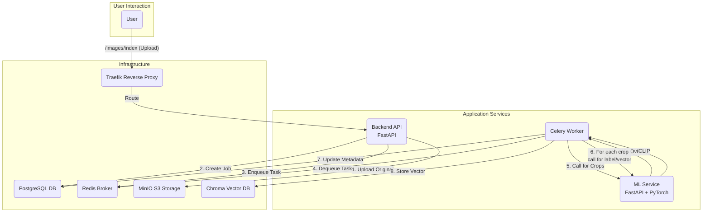

# Fashion AI Assistant

A visual search engine for fashion. Upload an image of a person, and the system automatically detects, crops, and indexes each clothing item, allowing you to find visually similar products from your catalog.

## System Architecture

This project uses a microservices architecture designed for scalability and asynchronous processing. All services are containerized with Docker and orchestrated via `docker-compose`.



### Core Features

* **Async Image Processing:** Jobs are handled in the background with Celery and Redis, ensuring the API remains responsive.
* **AI-Powered Cropping & Labeling:** Uses YOLOv8 to detect clothing items and CLIP to generate structured labels (category, color, etc.) and embeddings.
* **Vector-Based Similarity Search:** Stores embeddings in ChromaDB to find the most visually similar items.
* **Scalable Infrastructure:** Built with Docker, Traefik (for routing), and MinIO (for S3-compatible storage).

### Tech Stack

* **Backend:** Python, FastAPI, Celery, SQLModel, PostgreSQL, Redis
* **ML Service:** Python, FastAPI, PyTorch, YOLOv8, CLIP
* **Infrastructure:** Docker, Docker Compose, Traefik, MinIO, ChromaDB
* **DevOps:** Multi-stage Docker builds, Healthchecks, Centralized configuration.

---

### Getting Started

#### Prerequisites

* Docker and Docker Compose
* An Nvidia GPU with drivers is required for the `ml_service`.

#### 1. Configure Environment

Create a `.env` file in the project root by copying the example.

```bash
cp .env.example .env
```

Review and adjust the values in the `.env` file if needed. The defaults are configured to work with Docker Compose.

#### 2. Build and Run

From the project root, run:

```bash
docker-compose up -d --build
```

* The backend API will be available at `http://backend.docker.localhost`
* The Traefik dashboard is at `http://localhost:8080`
* The Flower (Celery monitor) dashboard is at `http://flower.docker.localhost`

---

### How to Use

The system has two primary workflows: indexing a new product image and querying for similar items.

#### Index an Image

Upload an image containing clothing. The system will process it asynchronously.

```bash
curl -X POST -F "image_file=@/path/to/your/image.jpg" http://backend.docker.localhost/images/index
```

The API will immediately return a `202 Accepted` response with the job details. You can poll the job ID to track its status (`QUEUED` -> `CROPPING` -> `ANALYZING` -> `COMPLETE`).

#### Query for Similar Items

Upload an image to find similar products already in the database.

```bash
curl -X POST -F "image_file=@/path/to/your/query_image.jpg" http://backend.docker.localhost/images/query
```

The API will return a `202 Accepted` response. Once the job is `COMPLETE`, you can retrieve the query results, which link the detected clothes to the most similar items in your vector database.

---

### Project Structure

```.
├── backend/            # FastAPI API, Celery worker, DB models, business logic
├── chroma_db/          # Dockerfile for ChromaDB service
├── ml_service/         # Stateless FastAPI service for YOLO and CLIP models
├── docker-compose.yml  # Defines all services and infrastructure
└── README.md           # This file
```

### Roadmap & Future Improvements

* **Crop Quality Filtering:** Implement a validation step to discard low-quality or irrelevant crops before labeling.
* **Enhanced Search:** Add metadata filtering to vector searches (e.g., find "blue shirts" only).
* **Frontend UI:** Develop a simple web interface for uploading images and viewing results.
* **Human-in-the-Loop:** Build a simple admin tool for correcting AI-generated labels to create a high-quality dataset for model fine-tuning.
* **Observability:** Integrate Prometheus and Grafana for robust monitoring of all services.
